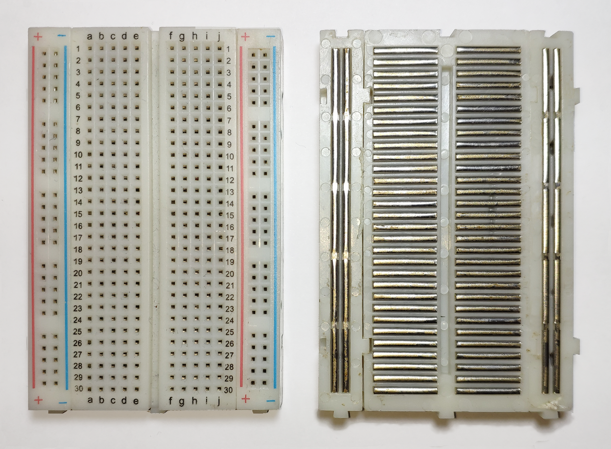
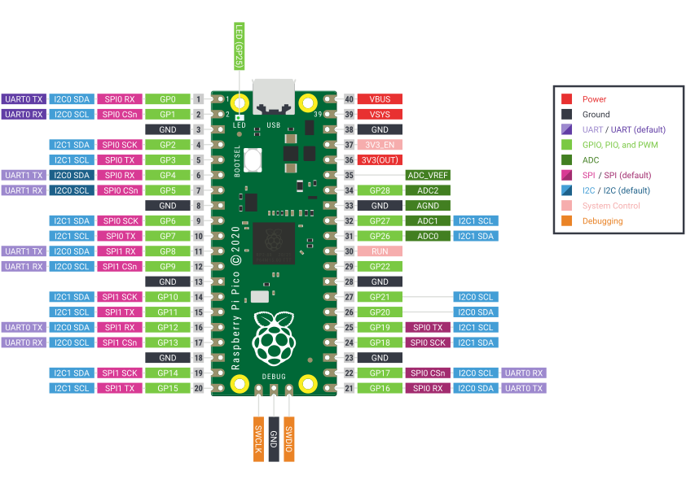
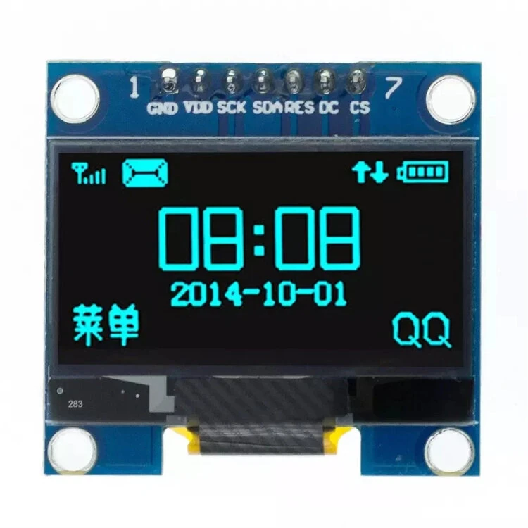

# Lesson 5 - Connecting and programming the OLED

## Step 1 - Solderless breadboards

Solderless breadboards let you quickly wire a circuit, so you can test its functionality.  Along with jumper wires terminated with male DuPont connectors, they are ubiquitous in the electronics world.  In order to make use of the breadboard, we have to understand how the holes are connected internally.



There are two metal rails running the length of the breadboard on both sides.  These are the "voltage rails".  The red plus marks the positive rail, and the blue negative marks the negative rail.  You can have separate voltages on opposite sides of the rail, or they can be the same.  The point of these rails is to make sure you can always reach Vcc and GND, even with a short jumper wire.

Between the voltage rails are shorter rails oriented perpendicular to the voltage rails.  Note that they are not joined at the center.  This allows us to install integrated circuit chips straddling the middle line, and it lets us independently connect each pin as needed using the short rails.

In our project, the Pi Pico receives power via the USB connector plugged into our computer.  The Pi Pico has an onboard buck-boost switch mode power supply that feeds it 3.3 volts (often written as 3v3).  This is provided to us via pin 36, which is labelled "3v3(OUT)" (see Pi Pico pinout image below).  We're going to connect this pin to the nearest positive rail.  We'll also connect pin 38, which is one of the ground pins, to the negative, or ground, rail.

Note that the general-purpose input/output (GPIO) pins of the Pico have a GPIO number and a pin number that are different.  We will use the pin number for wiring, but we always have to use the GPIO number in the software.  All of the Pico SDK functions that ask for a pin number are asking for a GPIO number.




## Step 2 - Wiring the OLED

The 128x64 pixel OLED modules come in I2C and SPI versions, with the SPI version being a little less popular.  I have elected to use the SPI version, because the SPI bus can be shared with an SD card reader or the OLED can be replaced with a larger TFT display.  Both of these require SPI bus.



Every device needs a voltage source (Vcc or Vdd usually) and a ground (GND usually).  SPI devices additionally have a serial clock (SCK usually) that controls the rate at which data will be fed to the device.  They have a serial data in (SDI or SDA or RX) where they will receive serial data, and/or they have a serial data out (SDO or SDA or TX) where they will provide serial data, depending on the function of the device.  They will also have a chip select (CS or CSn) that is a discrete line used by the processor to choose which device on the bus is active.  Each device should have its own chip select, and only one should be active at a time unless there are multiple of the same device.  This OLED has a data/command pin (DC) to tell the device whether we're sending pixel data or commands, such as clear screen.  Finally, this OLED has a reset pin (RES) to reset the device to a known state.

The pins of the OLED are labelled (from the front) GND, VDD, SCK, SDA, RES, DC, and CS (see image).  GND will be connected to the negative, or ground, rail.  VDD will be connected to the positive rail.  The SCK, or serial clock, pin will be connected to pin 24 on the Pico, which is SPI0 SCK.  The SDA, or serial data, pin will be connected to pin 25 on the Pico, which is SPI0 TX.  The RES, or reset, pin will be connected to pin 27 on the Pico.  The DC, or data/command, pin will be connected to pin 26 on the Pico.  Finally, the CS, or chip select, pin will be connected to pin 22 on the Pico, which is the SPI0 CS.


## Step 3 - Cloning the OLED repo

We're going to be using the Jac0bXu/pico-ssd1306-spi library to drive our OLED.  This library is a branch of the popular daschr/pico-ssd1306 library, which supports only I2C.  The library supports pixel-based drawing of shapes and images, as well as font rendering for text output.

Rather then clone the repo and reference it through an environment variable or hardcode its location, we're going to pull it into our repo as a submodule.  I generally do this with smaller libraries that I may use in multiple projects.  If I cloned them into a location outside of the project, then each of you would have to clone it too.  I will clone it as a submodule by cd'ing to root directory of this repo and issuing the following command:
```
git submodule add https://github.com/Jac0bXu/pico-ssd1306-spi thirdparty/pico-ssd1306-spi
```

You **do not** need to run this command.  Instead, you will do a submodule update after cloning the project repo.  If you haven't already, run the following command in your ~/git directory:
```
git clone https://github.com/clatham/pico-gps-oled.git
```

Once the clone is complete, run the command:
```
git submodule update --init  --recursive
```

You should now have the thirdparty/pico-ssd1306-spi directory.


## Step 4 - Update our CMake

We need to build the OLED library as part of our application, so we need to modify the add_executable() call to include the following line:
```
../thirdparty/pico-ssd1306-spi/ssd1306.c
```

This library is going to include headers from within the library.  To ensure the compiler can find these, we need to add the library directory to the include directories.  We do this by adding the following lines below the add_executable() directive:
```
target_include_directories(pico-gps-oled PRIVATE
    ${CMAKE_SOURCE_DIR}/../thirdparty
    ${CMAKE_SOURCE_DIR}/../thirdparty/pico-ssd1306-spi
)
```

Lastly, we need to link against the hardware SPI library by adding the following line to the target_link_libraries() directive:
```
hardware_spi
```


## Step 5 - Update our main.c

First, we need to include the OLED library and the font that we'll use by adding the following includes:
```
#include "ssd1306.h"
#include "pico-ssd1306-spi/example/BMSPA_font.h"
```

There are several fonts in the pico-ssd1306-spi/example/ directory that you can use.  I chose the BMSPA font, because it looks decent even at small point sizes.

Next, let's add defines for the SPI configuration with the following lines:
```
/* SPI pin definitions */
#define SPI_PORT spi0
#define PIN_CS   17   /* Chip Select (directly connect to GND if only one device) */
#define PIN_SCK  18   /* SPI clock */
#define PIN_MOSI 19   /* SPI MOSI (data) */
#define PIN_DC   20   /* Data/Command */
#define PIN_RST  21   /* Reset */
```

We're just defining the pins that we already talked about in the section on wiring.  Now let's use them to initialize the SPI port and the OLED by adding the following lines to the init section of our main() function:
```
/* Initialize SPI at 1MHz */
spi_init(SPI_PORT, 1000000);
gpio_set_function(PIN_SCK, GPIO_FUNC_SPI);
gpio_set_function(PIN_MOSI, GPIO_FUNC_SPI);

/* Chip select - optional, can be tied to GND */
gpio_init(PIN_CS);
gpio_set_dir(PIN_CS, GPIO_OUT);
gpio_put(PIN_CS, 0);  /* Select the device */
```

This initializes the SPI port to 1 MHz, and it tells the system that SCK and MOSI pins will be used for SPI.  The CS pin we directly control ourselves.  Since we're only using one SPI device, we could've just wired CS directly to ground.

With SPI initialized, it's time to initialize the device using the OLED library.  Add the following to the init section of main():
```
ssd1306_t disp;
disp.external_vcc = false;

ssd1306_init(&disp, 128, 64, PIN_DC, PIN_RST, SPI_PORT);
```

This creates the display object and initializes it for us to use.

Finally, we'll display something on the OLED in our infinite loop:
```
ssd1306_clear(&disp);

ssd1306_draw_string(&disp, 24, 24, 1, "Hello, world!");

char buf[10];
snprintf(buf, 10, "%llu", now);
ssd1306_draw_string(&disp, 40, 32, 1, buf);

ssd1306_show(&disp);
```

First, we clear the OLED.  Next, we draw our "Hello, world!" message onto the screen.  Then we convert the "now" counter to a string, and we draw that to the OLED as well.  Finally, we draw the pixels to the OLED with the show command.


## Conclusion

Now you can draw strings to the OLED, but we haven't touched any of the other drawing capabilities.  Take a look at the "ssd1306.h" header in the OLED library.  There are plenty of primitive and bitmap drawing functions in there with which to experiment.
